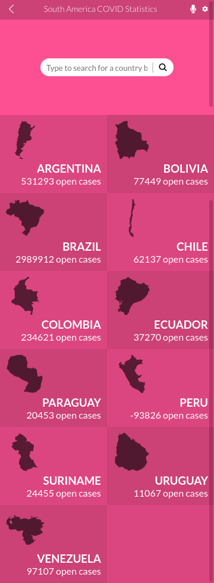
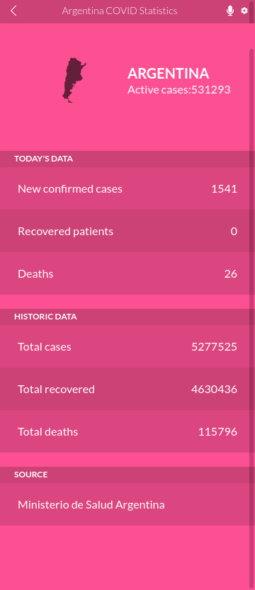

# covid-data-display

Mobile web app to display COVID data from South American countries.

### [Live version](https://notlfish-covid-data-display.netlify.app/)
### [Project presentation video](https://www.loom.com/share/c9ab4a49258249fcba434c47ab046b1e)




## Built With

- HTML
- CSS3
- JavaScript
- React
- Redux

## Getting Started
**You'll need to have git, npm and yarn installed in you environment to follow these instructions.**
To get a local copy of the repository please run the following commands on your terminal:

```bash
$ cd <folder>
$ git clone https://github.com/notlfish/covid-data-display.git
$ cd covid-data-display
```

To be able to serve the project on your computer, you'll need to install the developer's dependencies.
```bash
$ npm install
```

With this, you can use
```bash
$ yarn build
$ yarn start
```
To build the project and to start a server, respectively. `yarn start` should open the page in a browser by itself, if it
doesn't, you can just access `localhost:3000` to see the project.

## Author

👤 **Lucas Ferrari Soto**

- GitHub: [@notlfish](https://github.com/notlfish)
- Twitter: [@LucasFerrariSo1](https://twitter.com/LucasFerrariSo1)
- LinkedIn: [LinkedIn](https://www.linkedin.com/in/lucas-mauricio-ferrari-soto-472a3515a/)

## Acknowledgements
The design of this page follows the desing by [Nelson Sakwa](https://www.behance.net/sakwadesignstudio) that can be found in [Benhance](https://www.behance.net/gallery/31579789/Ballhead-App-(Free-PSDs))

The country shapes are taken from [Regis Freyd's](https://github.com/djaiss) [mapsicon repository](https://github.com/djaiss/mapsicon)

Big thanks to them for making their available to use for the minimal price of acknowledgement!

## 🤝 Contributing

Contributions, issues and feature requests are welcome!

Feel free to check the [issues page](https://github.com/JAAR91/Awesome-books/issues).

## Show your support

Give a ⭐️ if you like this project!

## 📝 License

[MIT](/LICENSE)
